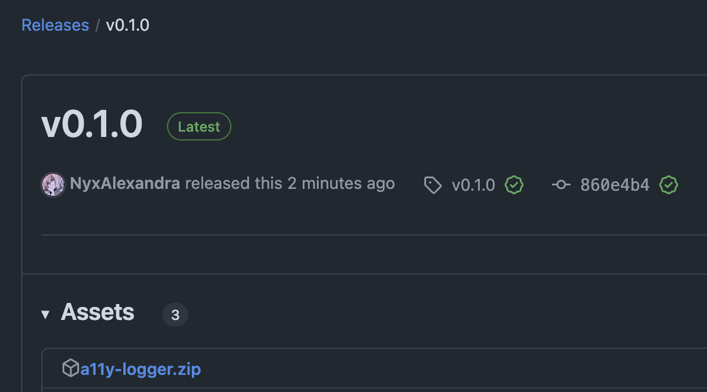
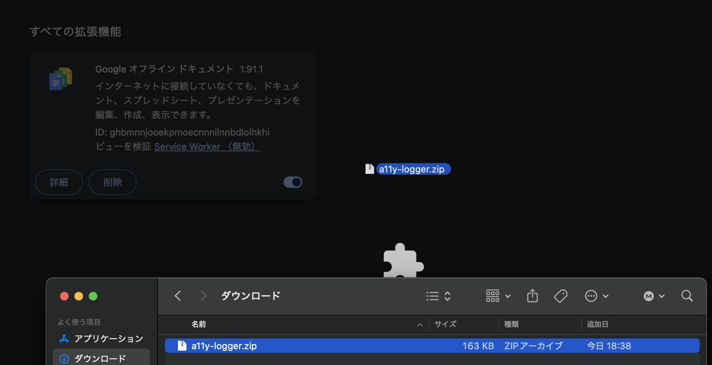
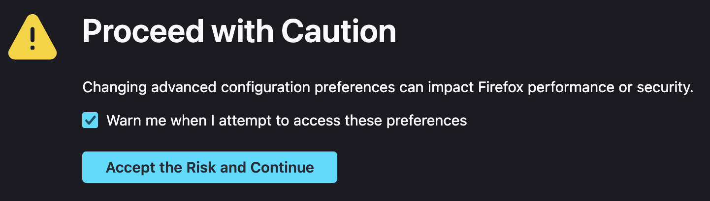

# A11y Logger

## Installation
 
- Download `a11y-logger.zip` from the [releases page](https://github.com/NyxAlexandra/a11y-logger/releases/latest).

  

- Follow the instructions for your particular browser.

### Chrome

- Navigate to `chrome://extensions`.

  

- Drag and drop the `a11y-logger.zip` file into the main area.

  

### Firefox

Firefox requires all installed extensions to be signed. As this is not possible,
you must disable this.

- Navigate to `about:config`.
  
  

- Firefox will inform you that some changes to browser configuration can cause
  issues. Select "Accept the risk and Continue".
  
  
- Enter `xpinstall.signatures.required` into the search bar and set the value to
  `false`.
  
  

  After the conclusion of the study, is is fine to reset this value back to `true`.

## Instructions

After installation, select "A11y Logger" from the extensions list and open the
popup window. Select the play arrow to begin logging. After the end of the
school day, press the pause button to stop logging. Download the log file with
the download button on the right and email the `a11y-log.json` file to me at
<reaves.1@uaschools.org>.
