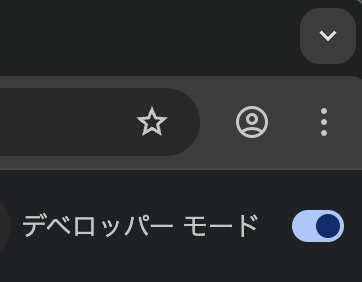

# A11y Logger

## Supported browser

This extension supports browser that are based on Chromium (such as Google Chrome,
Brave, Microsoft Edge, or Brave). While Firefox (and its derivatives) are supported,
Firefox [prevents the installation of unsigned addons](https://support.mozilla.org/en-US/kb/add-on-signing-in-firefox),
so participants are encouraged to use a Chromium-based browser for the duration of
the study.

## Installation

Download `a11y-logger.zip` from the [releases page](https://github.com/NyxAlexandra/a11y-logger/releases/latest).

Navigate to `chrome://extensions`.

Ensure "Developer mode" is enabled. After doing so, restart the browser.

Drag and drop the `a11y-logger.zip` file into the main area.

## Instructions

After installation, select "A11y Logger" from the extensions list and open the
popup window. Select the play arrow to begin logging. After the end of the
school day, press the pause button to stop logging. Download the log file with
the download button on the right and email the `a11y-log.json` file to me at
<reaves.1@uaschools.org>.
